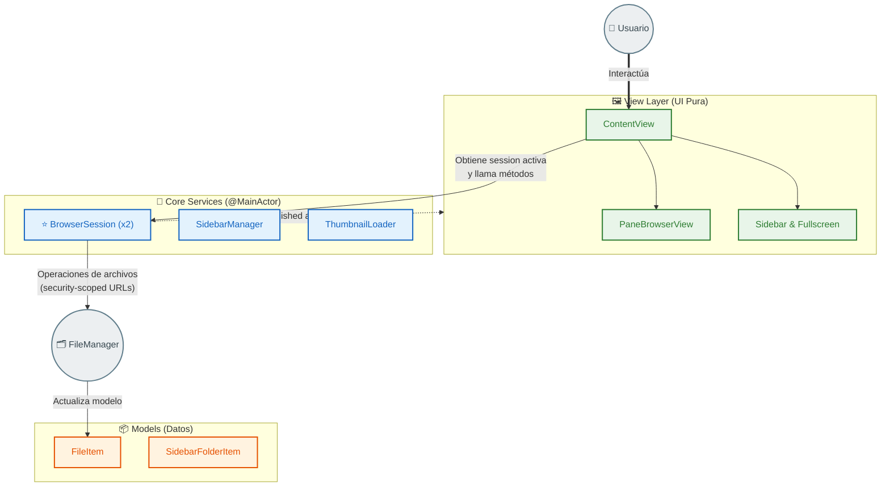

# xviewerSwift

**xviewerSwift** is a modern, lightweight, and fast image viewer and file manager built natively for macOS using SwiftUI. Designed for efficiency and seamless navigation, xviewerSwift provides a rich set of features that combine the power of a dedicated file manager with an intuitive image browsing experience.

## Features

### 🖼 Core Image Viewing
- **Responsive Grid View:** Browse thumbnails and folders in a fast, dynamic grid layout that adapts to your window size.
- **Full-Screen Viewer:** Double-click or press Space/Enter to launch a distraction-free, full-screen image viewer.
- **Quick Filters:** Apply basic, non-destructive filters on the fly. Use `Cmd + B` for Black & White (Grayscale) and `Cmd + I` for Color Inversion.
- **GIF & Animation Support:** Seamlessly view animated GIFs directly within the Full-Screen Viewer.
- **Enhanced Inspection:** Advanced zoom capabilities with image rotation support for detailed review.

### 📁 Advanced File Management
- **Favorites & RAW Workflow:**
  - **Quick Favorites (`Cmd + M`):** While in Full-Screen view, instantly copy the current image to a designated Favorites folder.
  - **Smart RAW Pairing:** When saving a favorite, the app automatically detects and copies any associated RAW file (e.g., `.cr2`, `.nef`, `.arw`) to keep your pairs intact.
  - **Global Settings:** Easily configure the destination path for your favorites via a sleek, native settings modal accessible from the sidebar.
- **Bulk & Single Renaming:** Easily rename single files (by pressing `F2`) or batch-rename multiple images sequentially with custom prefixes via the context menu.
- **Native Drag & Drop:** Seamlessly drag and drop files to move them into other folders within the grid or directly into pinned sidebar locations. 
- **Intelligent Collision Handling:** File movements and favorites copying handle naming conflicts automatically (appending suffixes like `_1` to images and their paired RAWs) without disrupting your workflow.
- **Create & Move:** Create new folders and move items using standard system dialogs.
- **Clipboard Support:** Copy (`Cmd + C`) and Paste (`Cmd + V`) selected items smoothly across directories.
- **Undo / Redo History:** Safely revert or re-apply file operations (like move, rename, delete) with native user notifications and standard keyboard shortcuts (`Cmd + Z` / `Cmd + Shift + Z`).
- **Context Menus:** Comprehensive right-click context menus for lightning-fast access to all file operations and selections.

### 🪟 Dual Pane (Split View)
- **Side-by-Side Browsing:** Press `Cmd + S` or use the toolbar button to activate a dual-pane layout for simultaneous, independent browsing of two folders.
- **Quick Transfer:** Move files instantly between the active and inactive pane using `Option + Left/Right Arrow` shortcuts. The destination pane refreshes automatically.
- **Smart Focus:** Click anywhere or press `Tab` to seamlessly switch focus between the left and right panels.
- **Cross-Pane Comparison:** Select images and use the compare functionality to visually evaluate them side-by-side across active panes, perfect for culling similar shots.

### 🧭 Navigation & Organization
- **Smart Sidebar:**
  - **Sources:** Quick access to standard directories like Home, Downloads, and Pictures.
  - **Bookmarks:** Pin your favorite or frequently accessed folders for immediate access.
  - **Recents:** Automatically tracks and dynamically sorts recently visited folders based on frequency of use.
- **Flexible Sorting:** Sort folder contents by Name, Date, or Size.
- **History Navigation:** Back and forward support to instantly jump between previously visited directories.
- **Dynamic Window Titles:** The application window title updates automatically to reflect your current folder and context.
- **Deep Keyboard Integration:**
  - Navigate grids and menus instantly using **Arrow keys**.
  - Jump directly to the first or last image using `Cmd + Shift + Up Arrow` and `Cmd + Shift + Down Arrow`.
  - Go up a directory using `Cmd + Up Arrow`.
  - Open a specific folder via dialog with `Cmd + O`.
  - Create a new folder quickly with `Cmd + Shift + N`.
  - Delete items using `Cmd + Backspace` or `Delete`.
  - Return to grid view or close modals with `Esc`.

### 🔍 Detailed File Properties
- **Properties Panel:** View detailed metadata about selected files, including file dimensions, accurate file size, and creation/modification timestamps.

### 🎨 External Integration
- **Open with Krita:** Dedicated integration to send images directly to the Krita digital painting application for advanced editing.
- **Open with Lightroom:** Right-click an image to send its corresponding RAW file directly to Adobe Lightroom for professional color grading. Automatically handles temporary workspace staging.

## Market Positioning & Target Audience
xviewerSwift is uniquely positioned at the intersection of a **lightning-fast image viewer** and a **dual-pane file manager**. 
It is specifically designed for photographers, digital artists, and visual creators who need to cull and organize thousands of images (including RAW + JPEG pairs) rapidly using keyboard shortcuts, without the overhead of heavy asset managers like Adobe Bridge or Lightroom's Library module. 
It competes with fast viewers like ApolloOne and FastRawViewer, but differentiates itself by offering robust, native dual-pane file management.

## Requirements
- macOS 13.0+ (Ventura) or later.
- Xcode 15.0+ (for building and development).

## Architecture
Built entirely with Swift and SwiftUI, focusing on concurrency (`async`/`await`) for non-blocking file I/O and thumbnail generation. Security-scoped URL handling ensures safe access to system directories chosen by the user.

### 3-Layer Clean Architecture

The app is structured to strictly separate UI from business logic and data:

1. **Models:** Pure data structures (`FileItem`, `SidebarFolderItem`, Thumbnail cache) with no business logic.
2. **Core Services:** The intelligence of the app, built as `@MainActor ObservableObjects`.
   - **`BrowserSession`** ⭐: The core engine handling folder contents, active selection, and all file operations (copy, move, delete, rename). Two instances exist independently for the left and right panes.
   - **`SidebarManager`**: Manages sources, bookmarks, and recently visited folders, persisting state to `UserDefaults`.
   - **`ThumbnailLoader`**: A concurrency semaphore that manages image loading (8 local slots, 2 remote).
3. **View Layer:** Pure UI that observes the core services.
   - `ContentView` routes keyboard actions and manages the dual-pane layout.
   - `BrowserSession` strictly handles file operations and does not know about the UI; `ContentView` does not know about `FileManager`. Each layer has a single, distinct responsibility.

---
*Developed with a focus on speed, utility, and native macOS aesthetics.*
